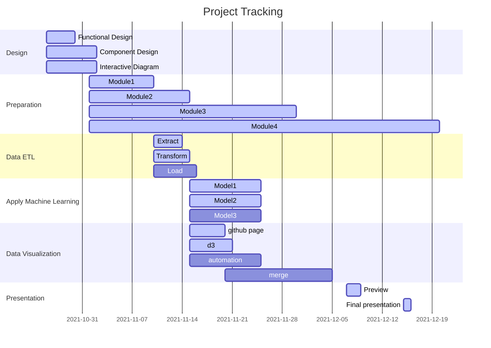

# Timeline

```mermaid
gantt
        dateFormat  YYYY-MM-DD
        title Project Tracking
        section Design
        Functional Design            :active,  des1, 2021-10-26,2021-10-30
        Component Design             :active,  des2, 2021-10-26, 7d
        Interactive Diagram          :active,  des3, 2021-10-26, 7d
        section Preparation
        Module1            :active,         des1, 2021-11-01,2021-11-10
        Module2            :active,  		    des2, 2021-11-01,2021-11-15
        Module3            :active,         des3, 2021-11-01,2021-11-30
        Module4            :active,         des4, 2021-11-01,2021-12-20
        section Data ETL
        Extract            :active,         des1, 2021-11-10,2021-11-14
        Transform          :active,  				des2, 2021-11-10,2021-11-15
        Load               :active          des3, 2021-11-10,2021-11-16
        section Apply Machine Learning
        Model1             :active,    			des1, 2021-11-15,2021-11-25
        Model2             :active,  				des2, 2021-11-15,2021-11-25
        Model3             :         				des3, 2021-11-15,2021-11-25
        section Data Visualization
        github page        :active,    			des1, 2021-11-15,2021-11-20
        d3              	 :active,  				des2, 2021-11-15,2021-11-21
        automation         :         				des3, 2021-11-15,2021-11-25
        merge              :         				des4, 2021-11-20,2021-12-05
        section Presentation
        Preview							:active, 				des1, 2021-12-07,2021-12-09
        Final presentation	:active, 				des2, 2021-12-15,2021-12-16
        
       

```

