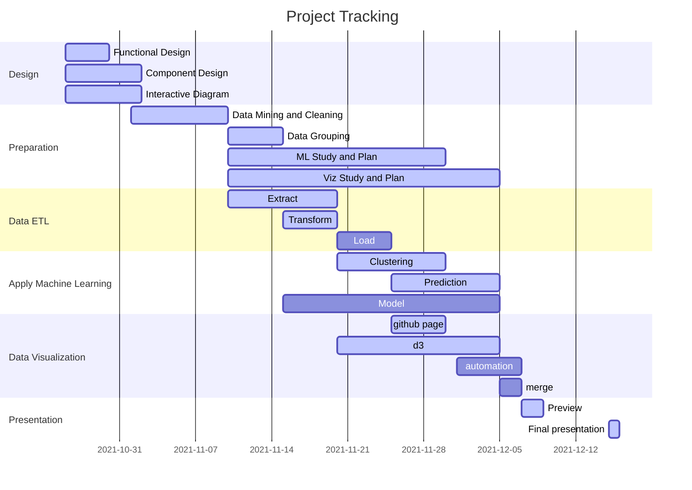

# Timeline

```mermaid
gantt
        dateFormat  YYYY-MM-DD
        title Project Tracking
        section Design
        Functional Design            :active,  des1, 2021-10-26,2021-10-30
        Component Design             :active,  des2, 2021-10-26, 7d
        Interactive Diagram          :active,  des3, 2021-10-26, 7d
        section Preparation
        Data Mining and Cleaning        :active,         des1, 2021-11-01,2021-11-10
        Data Grouping                   :active,  		des2, 2021-11-10,2021-11-15
        ML Study and Plan               :active,         des3, 2021-11-10,2021-11-30
        Viz Study and Plan              :active,         des4, 2021-11-10,2021-12-05
        section Data ETL
        Extract            :active,         des1, 2021-11-10,2021-11-20
        Transform          :active,  				des2, 2021-11-15,2021-11-20
        Load               :active          des3, 2021-11-20,2021-11-25
        section Apply Machine Learning
        Clustering         :active,    			des1, 2021-11-20,2021-11-30
        Prediction         :active,  				des2, 2021-11-25,2021-12-05
        Model              :         				des3, 2021-11-15,2021-12-05
        section Data Visualization
        github page        :active,    			des1, 2021-11-25,2021-11-30
        d3              	 :active,  				des2, 2021-11-20,2021-12-05
        automation         :         				des3, 2021-12-01,2021-12-07
        merge              :         				des4, 2021-12-05,2021-12-07
        section Presentation
        Preview							:active, 				des1, 2021-12-07,2021-12-09
        Final presentation	:active, 				des2, 2021-12-15,2021-12-16
        
       

```

